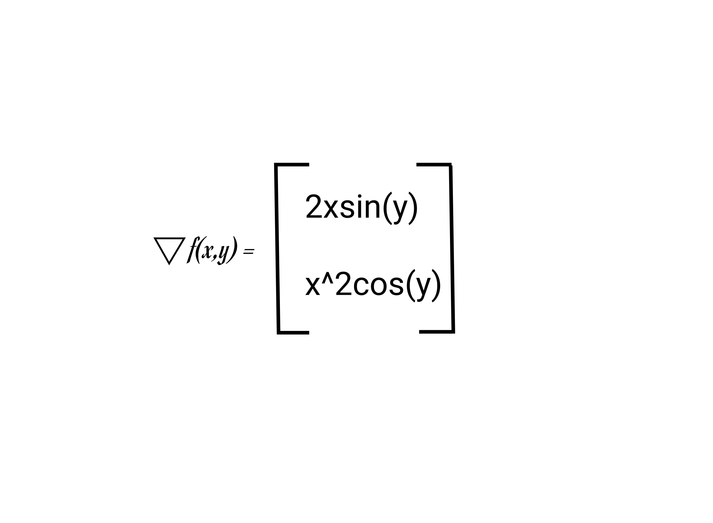
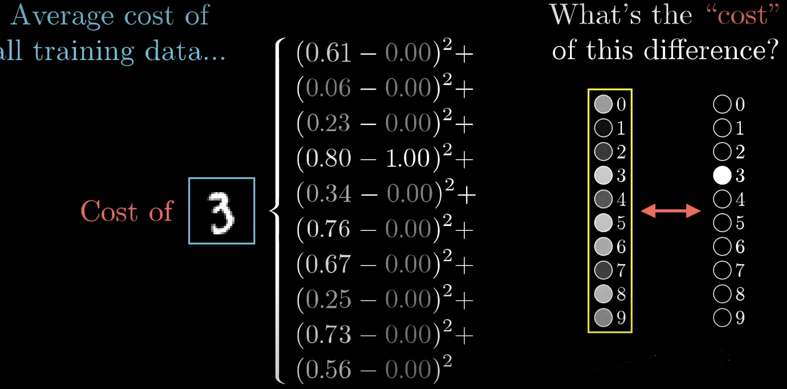
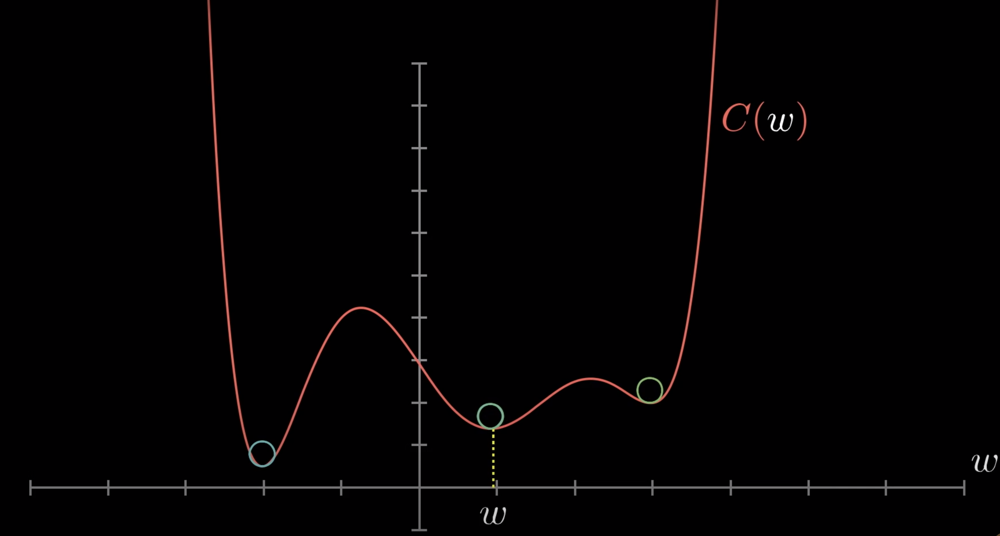

# Gradient Descent

# What is a gradient?

For a single variable equation, gradient is the slope of the equation. 

Gradient is a way of packing together all the partial derivaties of a multi-variable function into a vector.

# How do we compute gradient?

For example if you are given:

## Step 1: Find the partial derivatives with respect to both x and y

Partial derivative w.r.t x → 

Partial derivative w.r.t y → 

## Step 2: Once you have these two equations, put them into a vector.

**∇ (nabla)**  → The symbol for Gradient

The gradient of any function is equal to a vector with its partial derivatives. Hence Gradient could be called as a "full-derivative" since it captures all the partial derivative inside the function and puts it inside a vector representation.

### Exercise 1

* Compute the gradient of the following math function.

**Example Input:**

**Example Output:**

### Exercise 2

* Write a python function, that takes a math equation (like the one in exercise 1), as an argument and returns the gradient of the equation.

**Example Input:**

**Example Output:**

# Gradient in graphs

Watch this [video](https://www.khanacademy.org/math/multivariable-calculus/multivariable-derivatives/gradient-and-directional-derivatives/v/gradient-and-graphs) that explains about gradient in graphs.

Gradient shows you which direction you should go inside the graph to increase your goal. Your goal being achieving the highest height on the graph.

The gradient points in the direction of steepest ascent. This mean the gradient will point to where you should go to achieve the maximum height in the graph.

**Gradient Ascent → Finding the maximum height(point) of a graph.**

**Gradient Descent → Finding the minimum point of a graph.**

For gradient ascent, we are trying to increase the value of **f**, where **f** is the height of the graph.

So the gradient vector will point towards where the graph is increasing in height and getting steeper. 

The gradient is zero when if going in any direction from the gradient vector, the height doesn't increase or decrease in value, but rather remains roughly constant. This means for 2D fields, the graph has reached a flat/plateau surface. 

# Gradient and contour maps

Watch this [video](https://www.khanacademy.org/math/multivariable-calculus/multivariable-derivatives/gradient-and-directional-derivatives/v/gradient-and-contour-maps) that explains more about this topic. 

# Gradient Descent in a Neural Network

Gradient Descent works by finding the minima of a certain function. 

minima ⇒ minimum height/ "valleys" of the function

## Gradient Descent and Cost Function

### What is Cost Function

Cost Function quantifies the error between predicted and expected values of each output of a model and presents it in the form of a single real number. 

- **Input of a cost function is all of the weights and biases of the Neural Network.**
- **The output is 1 number that describes how bad the weights and biases are so that they could be improved upon.**

### Calculating the cost function

The formula for cost function is: 

𝚺

For Example: For a digit classifier (MNIST), we calculate the cost function by subtracting the estimated - predicted value for each digit output, squaring them for each digit, and summing all of the values together. 

This sum is small when the network confidently classifies the image correctly. And large when it doesn't. 

Cost function calculates how bad the weights and biases are on the current Neural Networks so that they could be improved upon.

### Exercise 3

* Given the actual and predicted values of a digit classifier in 2 arrays, write a function to calculate the cost function.

**Example Input**

**Example Output**

# Gradient Descent

Is used to minimize the cost function. 

If cost function is graphed, the gradient descent is going towards the direction of where the steepest slope is.

What's the downhill direction?

To find where the cost function will be close to zero, because when the cost function is a small value, it means our model is correctly predicting the value that we want. 

Helps us find the lower/minimum cost function.

Gradient of a function gives us the direction of the steepest ascent.

So taking the negative of that gradient will give the direction to decrease the function most quickly.

### The overall algorithm for minimizing the cost function

1. Compute the gradient direction
2. Take a small step downhill (take the negative of the gradient)
3. Repeat

Gradient descent → repeatedly changing the weights and bias of an input function by some multiple negatives of a gradient.

It's a way to converge to a local minimum of a cost function.
 
# Resources

[Gradient descent video](https://www.youtube.com/watch?v=IHZwWFHWa-w&ab_channel=3Blue1Brown)

[Khan academy Gradient and directional derivatives](https://www.khanacademy.org/math/multivariable-calculus/multivariable-derivatives/gradient-and-directional-derivatives/v/gradient)

[https://towardsdatascience.com/coding-deep-learning-for-beginners-linear-regression-part-2-cost-function-49545303d29f](https://towardsdatascience.com/coding-deep-learning-for-beginners-linear-regression-part-2-cost-function-49545303d29f) → cost function
